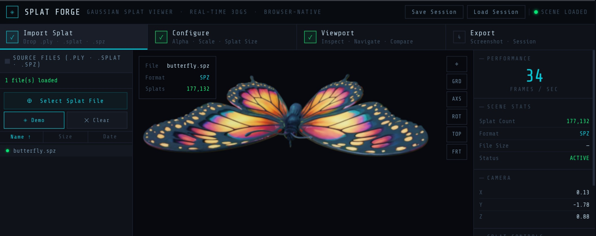

# SPLAT FORGE

**Real-time 3D Gaussian Splat Viewer — Standalone Browser Tool**

[](https://threejs.org)
[](https://sparkjs.dev)
[](LICENSE)
[](https://eldadeinav.github.io/splat-forge/)

> Drop a `.ply`, `.splat`, `.spz`, or `.ksplat` file — preview it instantly in your browser. No installation. No server. No Blender.



---

## Overview

Splat Forge is a lightweight, browser-native viewer for **3D Gaussian Splatting (3DGS)** scenes. It targets fast iteration and immediate visual feedback — especially useful when you need to inspect, validate, or present a splat capture outside of a full DCC or game engine pipeline.

Built on [Three.js](https://threejs.org) and [Spark](https://sparkjs.dev), the entire tool ships as a **single `.html` file** with zero build steps or dependencies to install.

---

## Live Demo

**[→ Open Splat Forge](https://eldadeinav.github.io/splat-forge/)**

Click **Demo Scene** to load an embedded `.spz` sample without uploading any file.

---

## Features

| Feature | Details |
|---|---|
| No installation | Single `.html` file — open in any modern browser |
| Drag & drop import | Drop directly onto the viewport |
| Formats | `.ply` · `.splat` · `.spz` · `.ksplat` |
| Real-time 3D preview | OrbitControls — orbit, pan, zoom |
| Splat controls | Alpha threshold · Scale · Splat size (live) |
| Viewport toggles | Grid floor · Axes helper · Auto-rotate |
| Camera presets | Reset · Top view · Front view |
| Scene stats | Splat count · Format · File size · FPS |
| Camera readout | Live X/Y/Z position |
| Screenshot export | PNG capture of the current viewport |
| Step wizard UI | 4-step workflow matching production pipelines |
| Operation log | Timestamped log for all actions and errors |
| Offline capable | Works fully offline after first load (CDN scripts cached) |

---

## Quick Start

### Option A — Browser (CDN, internet required)

1. Download [`index.html`](index.html)
2. Open it in **Chrome**, **Firefox**, or **Edge**
3. Drop a `.ply` / `.splat` / `.spz` / `.ksplat` file onto the viewport
4. Or click **Demo Scene** to load the built-in sample

### Option B — Local server (recommended)

```bash
# In the folder containing index.html
python -m http.server 8080
# Open: http://localhost:8080
```

### Option C — Offline (download CDN scripts once)

```bash
mkdir splat_forge_deps && cd splat_forge_deps

# Three.js
curl -O https://cdn.jsdelivr.net/npm/three@0.178.0/build/three.module.js

# Then update <script type="importmap"> in index.html to point to local paths
```

---

## Supported Formats

| Format | Description | Typical Source |
|---|---|---|
| `.ply` | Standard 3DGS output — full quality | COLMAP + 3DGS training, Polycam, Luma AI |
| `.splat` | Compressed web format (~50% smaller) | SuperSplat, GaussianSplats3D converter |
| `.spz` | Niantic compressed format (~90% smaller) | Scaniverse, Niantic Studio |
| `.ksplat` | Compressed format from GaussianSplats3D | mkkellogg/GaussianSplats3D converter |

---

## Where to Get Sample Splat Files

### Free CC0 / Public Samples

| Source | Format | Notes |
|---|---|---|
| **[SuperSplat Gallery](https://superspl.at)** | `.ply` `.splat` | Open-source browser editor — browse and download community scenes |
| **[Polycam Explore](https://poly.cam/explore)** | `.ply` | Community-captured real-world scenes — free to download |
| **[Sketchfab — Gaussian Splat tag](https://sketchfab.com/tags/gaussian-splatting)** | `.ply` | Various CC-licensed scans |
| **[INRIA Official Dataset](https://repo-sam.inria.fr/fungraph/3d-gaussian-splatting/)** | `.ply` | Original paper scenes — bicycle, garden, stump, etc. |
| **[Scaniverse](https://scaniverse.com)** | `.spz` `.ply` | Free mobile app (iOS/Android) — capture your own in minutes |

### Create Your Own

| Tool | Platform | Output | Notes |
|---|---|---|---|
| **[Scaniverse](https://scaniverse.com)** | iOS / Android | `.spz` `.ply` | Free — easiest way to capture from a phone |
| **[Polycam](https://poly.cam)** | iOS / Android / Web | `.ply` | Subscription — high quality, great for architecture |
| **[Luma AI](https://lumalabs.ai)** | Web | `.ply` | Upload video, get a splat back |
| **[KIRI Engine](https://www.kiriengine.com)** | iOS / Android | `.ply` | Free tier available |

> **Tip:** Scaniverse is the fastest way to create your first splat — scan any object in your environment in under 5 minutes, export as `.spz`, and drop it directly into Splat Forge.

---

## Interface Reference

### Step Wizard (top bar)

| Step | Action |
|---|---|
| 1 — Import | Load a splat file via drag & drop or file picker |
| 2 — Configure | Adjust alpha threshold, scale, and splat size |
| 3 — Viewport | Navigate, compare, inspect in real-time |
| 4 — Export | Screenshot, save session |

### Left Sidebar

| Control | Description |
|---|---|
| Select Splat File | Open system file picker |
| Demo Scene | Load built-in `.spz` sample (butterfly, via Spark CDN) |
| Clear | Remove current scene |
| File list | History of loaded files in this session |

### Viewport Controls (top-right overlay)

| Button | Action |
|---|---|
| ⌖ | Reset camera to framed view of the scene |
| GRD | Toggle grid floor |
| AXS | Toggle axes helper |
| ROT | Toggle auto-rotate |
| TOP | Switch to top-down view |
| FRT | Switch to front view |

### Mouse Navigation

| Input | Action |
|---|---|
| Left drag | Orbit |
| Right drag / Middle drag | Pan |
| Scroll | Zoom |

### Right Panel

| Section | Contents |
|---|---|
| Performance | Live FPS counter |
| Scene Stats | Splat count, format, file size, status |
| Camera | Live X/Y/Z position readout |
| Splat Controls | Alpha threshold, scale, splat size sliders |
| Viewport | Grid / axes / auto-rotate toggles |
| Export | Screenshot, session save |

---

## Technical Notes

### Renderer

Splat Forge uses [**Spark**](https://sparkjs.dev) (`@sparkjsdev/spark`) — an advanced Three.js-native 3DGS renderer built for WebGL2, targeting 98%+ device compatibility. Spark renders splats as `SplatMesh` objects that integrate natively with the Three.js scene graph.

### Performance

| Scene Size | Expected Performance |
|---|---|
| < 200k splats | 60 FPS on mid-range hardware |
| 200k–500k splats | 30–60 FPS |
| > 1M splats | May require a dedicated GPU |

For optimal web performance, target **100k–200k splats** at minimum 30k training steps. Use [SuperSplat](https://superspl.at) to trim unwanted floaters before loading large scenes.

### File Size Reference

| Splats | `.ply` (uncompressed) | `.spz` (Niantic) |
|---|---|---|
| 100k | ~22 MB | ~2 MB |
| 500k | ~110 MB | ~11 MB |
| 1M | ~220 MB | ~22 MB |

### Browser Compatibility

| Browser | Status |
|---|---|
| Chrome 90+ | ✅ Recommended |
| Firefox 88+ | ✅ Fully supported |
| Edge 90+ | ✅ Fully supported |
| Safari 15+ | ⚠️ Supported (some download quirks) |
| Mobile Chrome | ⚠️ Works for small scenes (< 200k splats) |

---

## Demo Scene Credit

The built-in demo scene (`butterfly.spz`) is provided by **[Spark / sparkjs.dev](https://sparkjs.dev)** and is used here for demonstration purposes under their sample assets terms.

---

## Related Tools

| Tool | Description |
|---|---|
| [**LOD Forge**](https://eldadeinav.github.io/LOD-FORGE/) | Browser-based LOD generator for OBJ / GLTF / GLB — export engine-ready LOD chains for UE5 and Unity |
| [**X-File Texture Swapper**](https://github.com/EldadEinav/X-File-Texture-Swapper) | Batch texture replacement pipeline for DirectX `.x` mesh files used in defense simulation |
| [**Facade Texture Pro**](https://github.com/EldadEinav/Facade-Texture-Pro) | Architectural facade texture generation pipeline — ComfyUI · SAM2 · Florence-2 · FLUX |

---

## Changelog

### v1.0.0
- Initial release
- `.ply` / `.splat` / `.spz` / `.ksplat` import via Spark renderer
- Real-time 3D preview with Three.js OrbitControls
- Alpha threshold · scale · splat size live controls
- Grid, axes, auto-rotate viewport toggles
- Camera presets: reset, top, front
- FPS counter + camera position readout
- Scene stats panel: splat count, format, file size
- PNG screenshot export
- Step wizard UI (4-step workflow)
- Timestamped operation log
- Built-in demo scene (butterfly.spz via Spark CDN)

---

## License

MIT — free to use, modify, and redistribute. Attribution appreciated.

Part of the **Simulation & Real-time Asset Pipeline** toolset by [Eldad Einav](https://github.com/EldadEinav).
